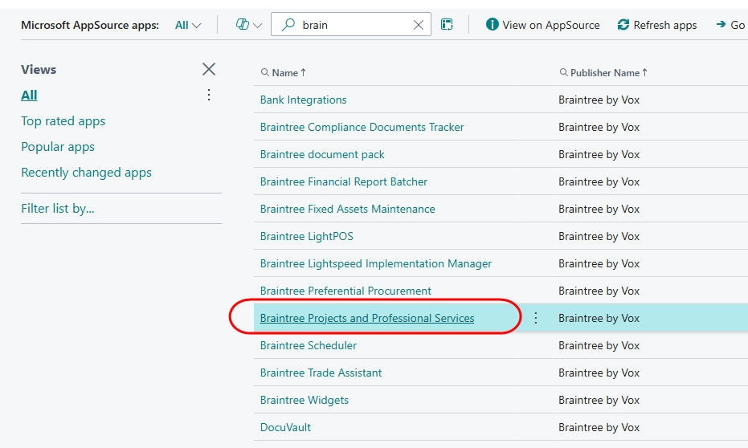
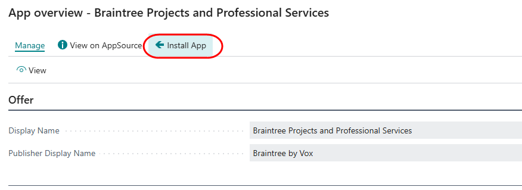
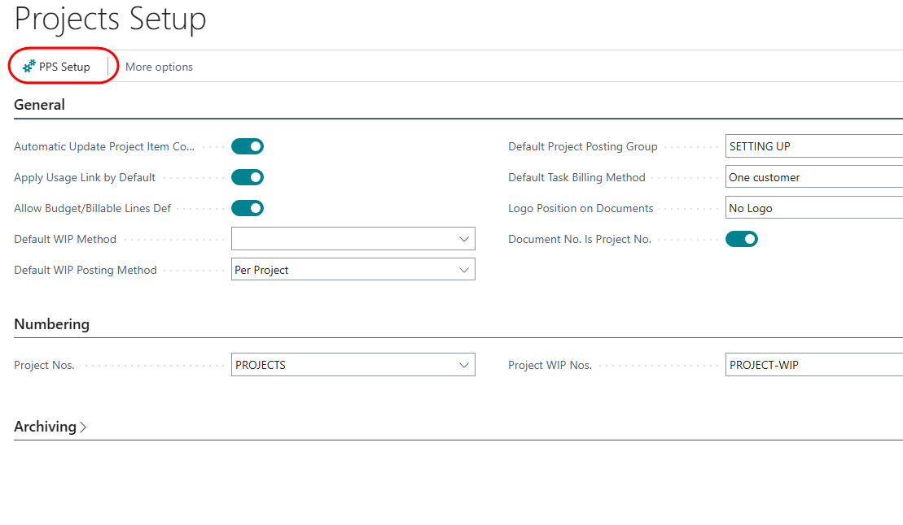

# Installation
You can install the application from Microsoft Market Place.
Open the Extension management page, and select the menu option 'AppSource Gallery'.
From the App list, search for Braintree Projects and Professional Services, and select the app.

From the app page, click on Install App.

Follow the prompts to complete the installation.

# PPS Setup

In addition to the standard setups required for the Business Central Projects module, there are some extra configurations required.

Search for 'Projects Setup' and open the page.
From the menu, select 'PPS Setup':

