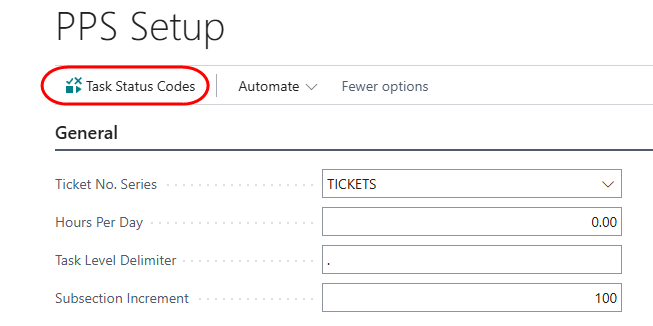
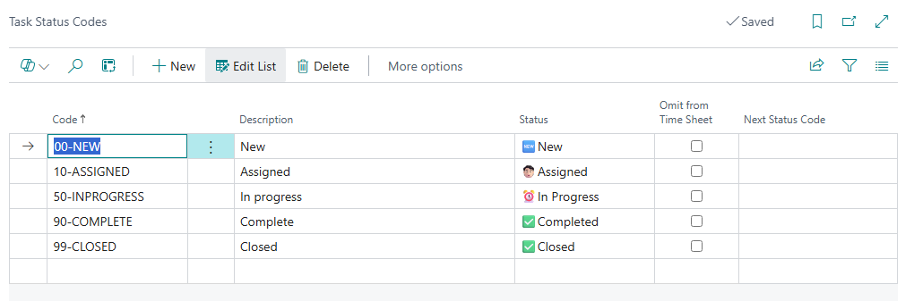
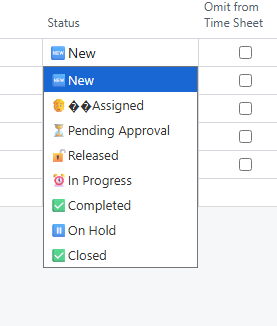

- [Installation](#installation)
- [PPS Setup](#pps-setup)
- [Task Status Codes](#task-status-codes)

# Installation
You can install the application from Microsoft Market Place.
Open the Extension management page, and select the menu option 'AppSource Gallery'.
From the App list, search for Braintree Projects and Professional Services, and select the app.

From the app page, click on Install App.

Follow the prompts to complete the installation.

# PPS Setup
In addition to the standard setups required for the Business Central Projects module, there are some extra configurations required.

Search for 'Projects Setup' and open the page.
From the menu, select 'PPS Setup':

# Task Status Codes
Task status codes are used to assign statuses to tasks on projects. 

From the PPS Setup page, select the menu option 'Task Status Codes':

The Task codes maintenance list is opened:

It's a good idea to create codes in a sequence that follows your process. Capture the details for each code as follows:

| **Field** | **Value** |
|---|---|
| Code | Unique identifier for the status, up to 10 characters  |
| Description | Description of the code |
| Status | Select an option from the drop down list | 
| Omit from time sheet | If turned on, tasks with this status will not be available on time sheets |
| Next Status Code | Select the status to which the task should be moved to in your process flow | 

**Status options**

