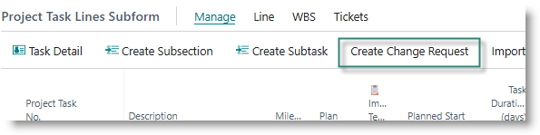
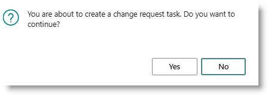
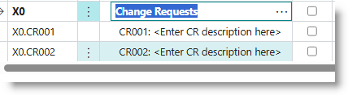
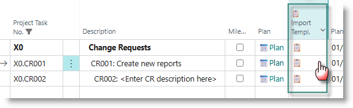
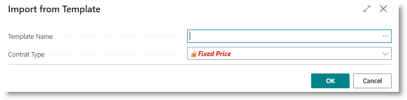
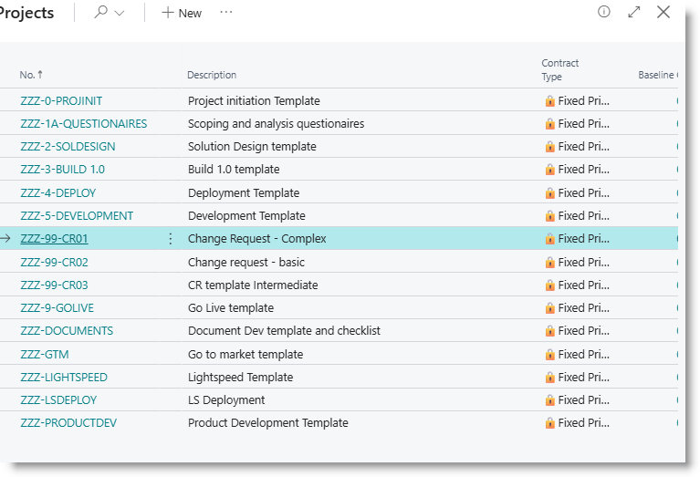
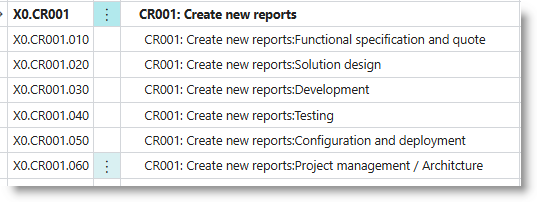

# Handling Change Requests on a Project
When you set up a new project, and create a WBS, a special section is created at the end of the WBS, with the task number 'X0'. On the project card, the tab 'Braintree Project Accounting' contains two fields:

- Change Request Section: initially set to 'X0'.
- Change Request Number: initially set to 'CR000'.

Although you can change the Section number, it is recommended that you leave it. This will ensure that CR's are kept at the end of the project WBS.

The Change Request Number provides a number sequence, starting at CR001, which will be part of the task number and description.  You can amend the change request number, provided the last 3 characters of the field are numeric.

## Creating a new Change Request
From the Project Task Lines subpage, click on 'Create Change Request':

Click on Yes in the dialog:

A new task is created, numbered 'X0.CRxxx' where xxx is the next sequence number. The task description ist set to 'CRxxx: Enter CR Description here'.

The task can be handled as a normal project task or support task. 

## Convert CR into a subsection
If a CR is more complex, you can convert it into a multi-task section.  
Click on the icon in the column 'Import Templ'.

The template import dialog will appear:

Click on '...', and select the required template from the list:

Click OK. The code of the template is copied into the template name. 
Amend the Contract Type if required, then click OK.
The CR line is converted to a Total line, and the lines from the template are copied into the project:

Continue to plan and assign resources to the tasks as required.

## Baseline the Change Request tasks
If the Change Request is costed as fixed price, it is a good idea to create a baseline for the tasks.