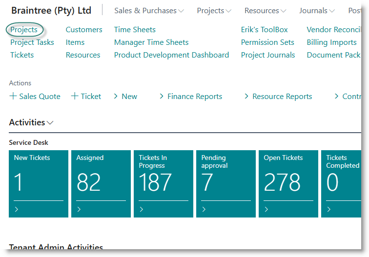
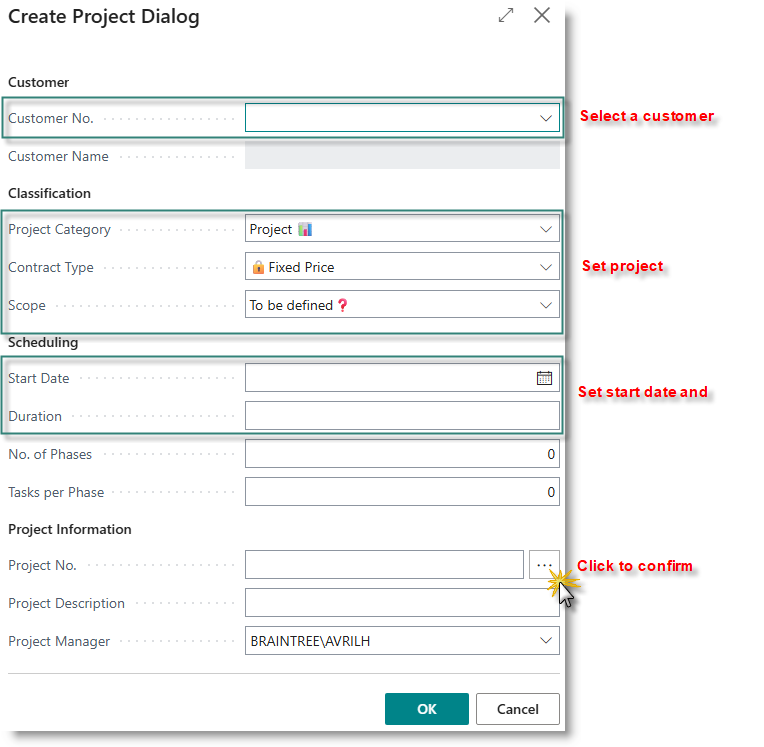
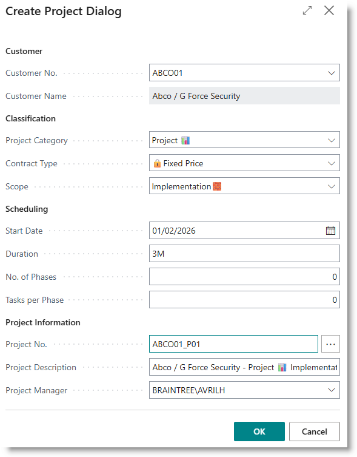
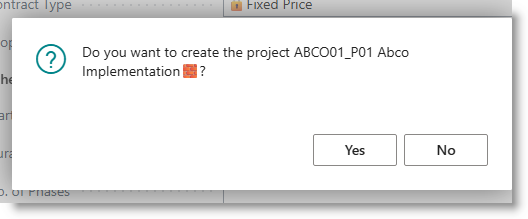

## Create a new Project

From the Role Centre, click on Projects:

From the projects list page, click on 'New'. The following dialog will appear:

Select a customer from the drop down.
Set the Project Category, Contract type and Scope. [Definitions](Projects-Overview#definitions)

Set a start date and duration.
Optionally enter number of phases, and number of tasks per phase that you would like to create. (You can add tasks or phases later).

Under Project Information, click on the ellipse next to the Project No. field. 

Example:

The system will populate the project number and generate a description. The project manager field defaults to the current user. You can edit these details if necessary.

Click on OK to complete the activity. Confirm the creation of the project by clicking Yes on the following dialog:

The project will be created and the project card will open.
