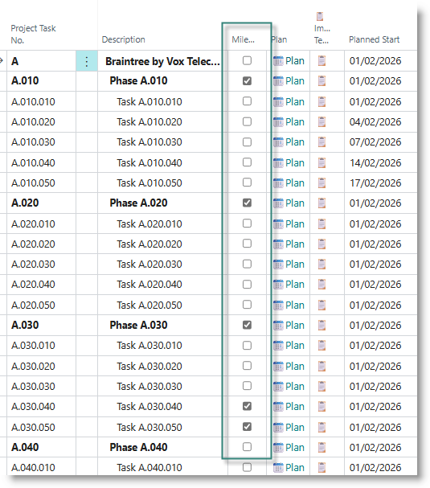
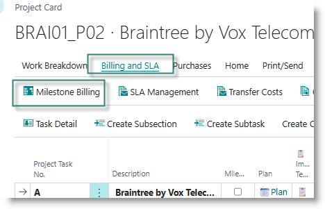
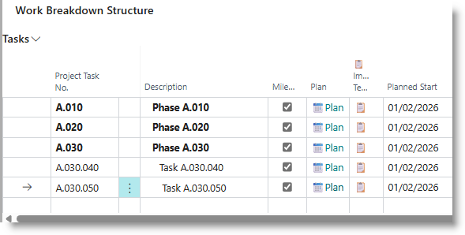
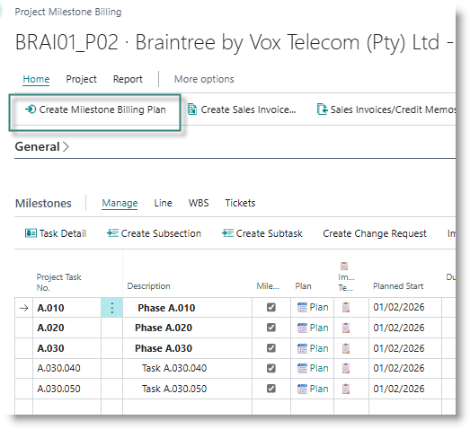
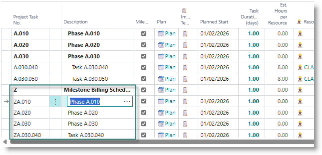

# Setting up Milestones and Milestone Billing Schedules
Milestones are used to mark significant checkpoints, or the achievement of key deliverable.  On fixed price projects, milestones may be linked to billing events.

On the project list within the project card, use the tick mark in the column 'Milestone' to mark a task as a milestone. This might be a parent task, or it might be specific, individual tasks.

## Generate billing milestones
To generate a billing plan for the milestones:

From the Project Card, select the Billing and SLA menu, then select 'Milestone Billing:

This will open the Milestone Billing worksheet.

Tasks marked as milestones will be displayed in the task list.

From the project card menu, click on 'Create Milestone Billing Plan'.

A new Total with the task number 'Z' will be created. For each milestone, a new Posting task will be created, numbered 'Z', followed by the milestone's task number. The task description will match the description of the original task.

For each milestone, a sales price is calculated from the underlying subsidiary tasks. A new planning line is created for the task:

| **Column** | **Definition** |
|---|---|
| Line Type | Billable |
| Type | G/L Account |
| No. | GL Account number for project sales | 
| Quantity | always set to 1 |
| Unit Price | Set to the sales value of the milestone |
| Total Price | Set to the sales value of the milestone |

You can amend the planning date on the planning lines, to reflect the date on which you intend to bill for the milestone.