## Plan tasks

Scheduling information and resource allocations are set at the lowest level tasks. (You cannot assign resources to a heading line or total line.)

Dependencies can be created between tasks by linking them.

One or more resources can be assigned to a task. For each resource, you can specify a planned duration, a level of effort and a rate of work (eg 4 hours per day). 

The columns below are affected by task planning:

### Plan a task
On the task subform, select a task, and click on the Plan button on the line:

This will open the Task Schedule dialog for the task:

Capture the details as follows:

| **Field** | **Content** |
|---|---|
| Work Type | Optional - select a value from the dropdown |
| Priority | Choose which time parameter should be used to calculate effort / duration / rate |
| Duration (days)| The number of elapsed days you anticipate the task to require | 
| Rate of effort | The number of hours per day you intend each resource to be working on the task |
| Effort per resource | The total number of hours each resource will work|
| Start Date | The date on which you plan to start the task |
| End Date | The date on which you plan to end the task. |
| Split planning | If set to On, a separate planning line will be created for each day of the task's duration | 

    Note: when you change the duration, or the effort or the rate of effort, at least on of the other two parameters must also be changed.

**Example 1: Planning Priority: Effort, Duration 5 Days**
If you change the duration to 5, the system will prompt you to update the effort, or the rate of effort:

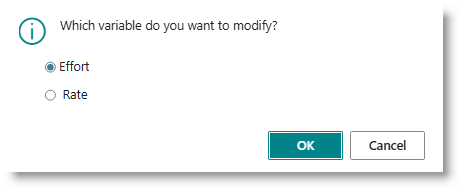

If you accept the default, the effort will be updated to reflect 40 hours (5 days at 8 hours per day). If you change the option to Rate, the Rate of Effort will change to 1.6 (8 hours divided by 5 days)

**Add one or more resources**
Click in the Resource List field. The Resource List page will appear:

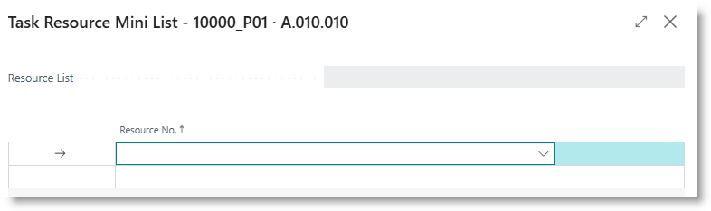

Select resources from the dropdown. You can add as many resources as needed.

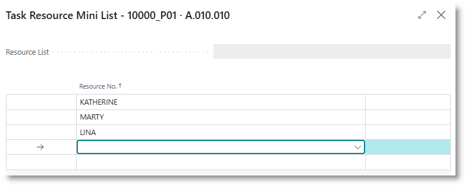

Click Close to return to the Task Schedule dialog. The resource names will appear in the Resource List field at the bottom of the page..

Click on OK to complete the plan. The Start Date, Duration, Resources and Planned Labour are updated on the task subpage. The task Status will change to Assigned.

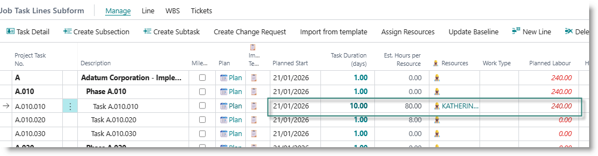

Additionally, the following changes are made to the plan:
- The task Status will change to Assigned.
- The Task Resource Request list is updated with an entry for each resource on the task, and hours are assigned according to the scheduling parameters.
  
  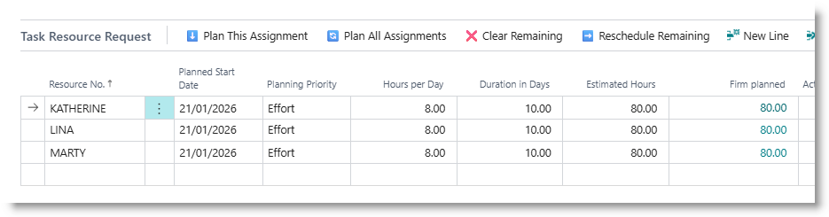

- Planning lines are created.

  

    Note: if your resource is assigned to the task for a full day (rate of effort is 8 or more hours), only one planning line will be created.  If your resource is assigned part time to the task (rate of effort is less than 8), a separate planning line will be created for each day.

### Add resources to a task
You can add more resources to a task in two ways: 
- from the task subpage, by clicking on the Resource column for the task
- from the Task Resource Request list

**Open Resource assignment**

  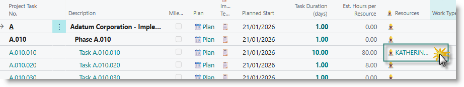

This will open the Task Resource Mini list. Add new resources as required, and click on OK. Each resource in your list will be added to the Task Request List, planning lines are created and the resource names will appear in the Resources column on the task subpage.

**Add resources via the Task Resource Request subpage**
Select a task on the task list. Check that the Task Resource Request list is visible below the task list.
Select a resource from the dropdown list in the Task Resource Request subpage:

  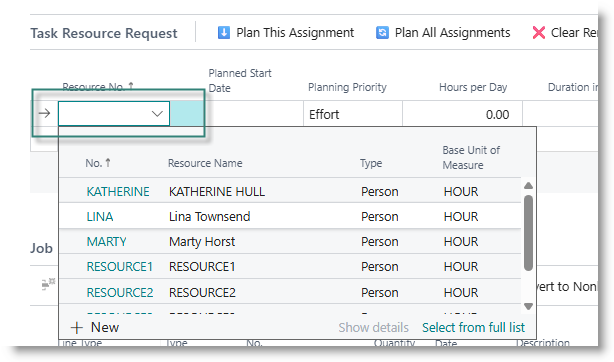

The default duration, effort and rate will be copied from the task to the resource request. You can update these as required. If there are multiple resources, you can vary the duration and effort for each resource. For example, one resource may work 40 hours on the task, and another may only be assigned for 20 hours.

  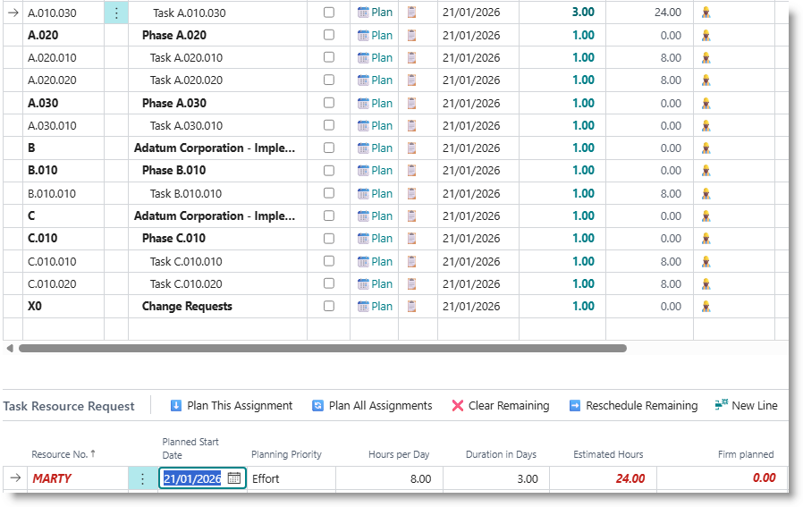

After updating the planned effort on the resource requests, click on 'Plan this Assignment' to create planning lines for the specific request, or 'Plan all Assignments' to update planning lines for all request.

  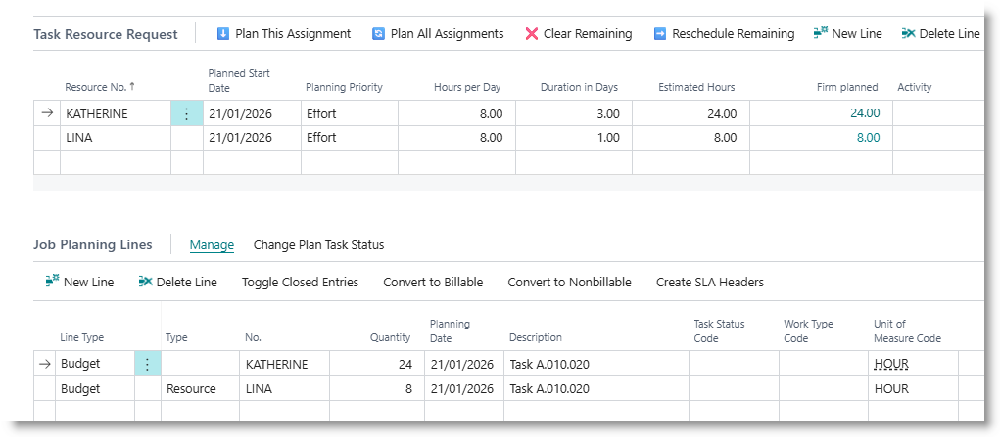

### Creating Task dependencies
When you create new tasks using the WBS functions, the system will create dependency links between successive tasks in the same section. You can create additional dependencies between any two tasks after initial task creation.

Select the tasks that you want to link by holding down the Ctrl key and click on each task. From the subpage menu, click on 'WBS' then on 'Link/Unlink', then on 'Link tasks':

  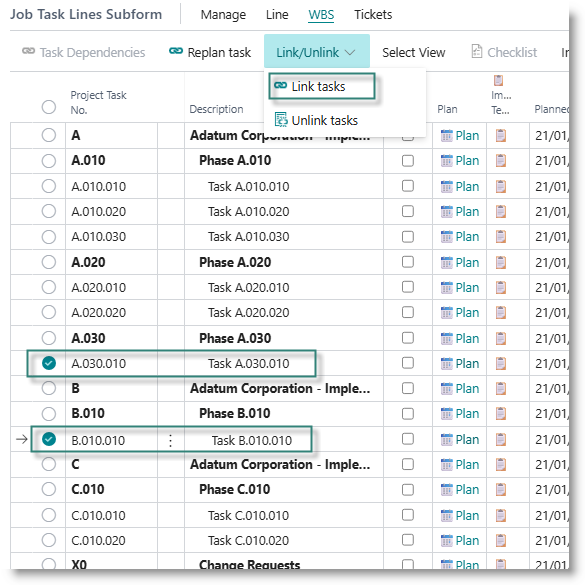

Use the WBS -> Link/Unlink -> Unlink Tasks function to remove the links.

### Replanning timelines
Once you have set durations and dependencies for all your tasks, you can replan the task dates. You can do this for a single task or for a set of selected tasks.

Select the tasks you want to replan, then click on WBS -> Replan task.

  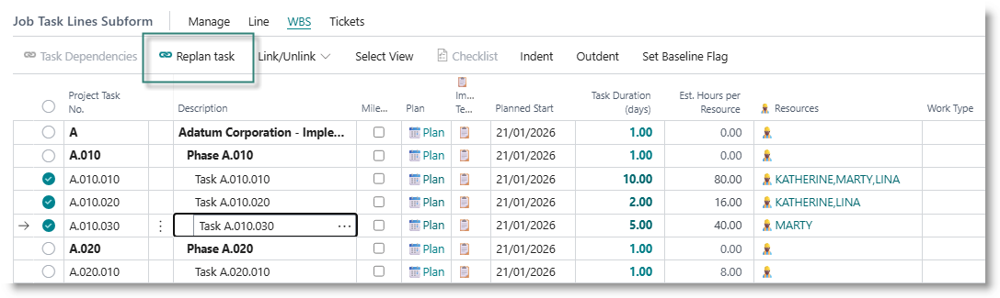

This will update the start date on downstream tasks, together with their related Task Resource Request and planning lines.

