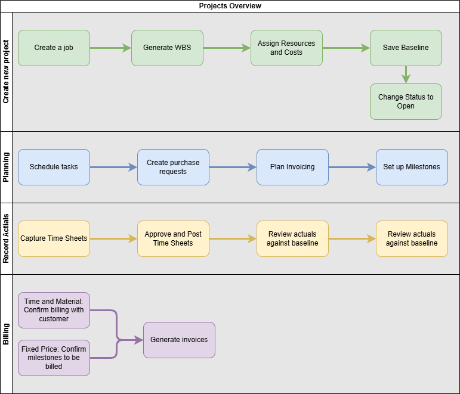
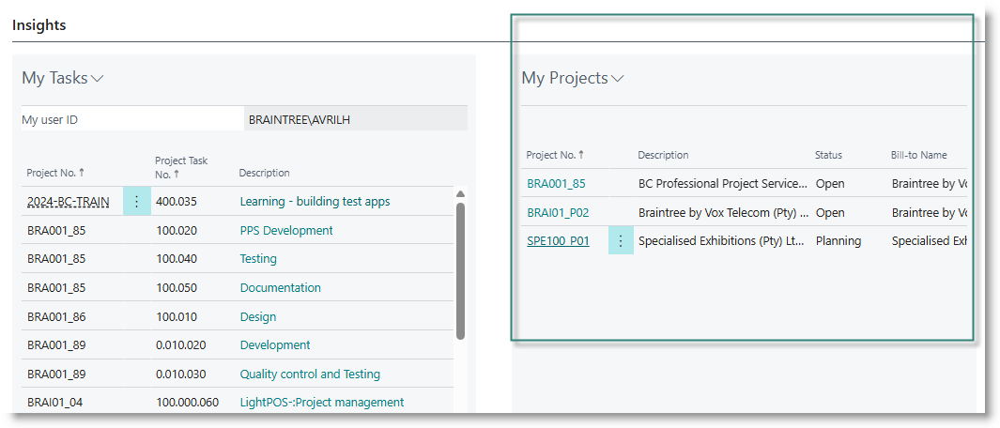
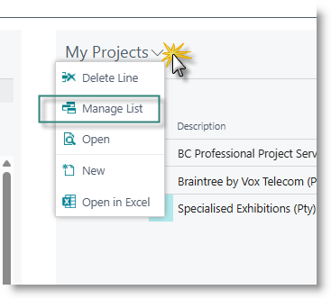
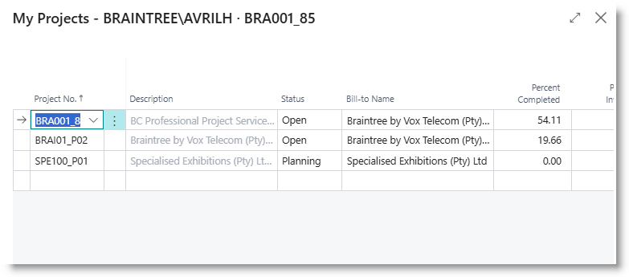
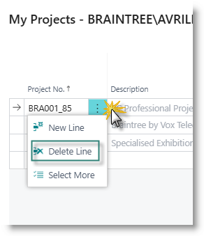

# Overview
The Projects module of Business Central is used to manage operations relating to professional services which Braintree offers to customers. These include delivery of projects (with a defined start and end, and fixed scope), and adhoc support. All work involving professional resources is organised into projects and tasks within the module. 

Data structures and data flows are described below. Specific details on how these are applied for management of support are discussed in the [Support Management](../Support-Management/Overview.md) section of this wiki. 

# Getting started
The preferred role centre for all users involved in 'Braintree PPS'. It's recommended that you switch to this role centre before continuing.

- [Data Structure](#data-structure)
- [Definitions](#definitions)
- [Create a Project](Create-a-New-Project)
- [The Work Breakdown Structure](Work-Breakdown-Structure)
- [Planning](Planning.md)
- [Setting a baseline](Setting-baselines)
- [Using Milestones](Milestones)
- [Recording Actual Costs](Recording-Actual-costs)
- [Understanding the Task subform and Card](Understanding-the-task-subpage)
- [Understanding Planning Lines](Understanding-planning-lines)
- [Calculating Earned Value]()
- [Change Requests](Change-Requests)
- [Checklists]()
- [Billing](Project-billing)

# Data Structure

* A customer can have many projects; a project can belong to only one customer.
* A project has one or more tasks, which can be arranged in a hierarchy; a task can belong to only one project.
* One or more resources can be assigned to a task, via a task resource request. The task resource request is used to generate Project Planning Lines, which provide the budget for the task, and can be used to manage resource scheduling.
* A task can be serviced by many resources.
* A resource may be assigned on many tasks.
* A task at the lowest level of the task hierarchy typically has one or more **planning lines** associated with it. A planning line is used to 
  * schedule and budget resources.
  * generate billing for time and material work
  * define billing events for fixed price projects
* Planning lines are used to create planned billing events, associated with a general ledger account. Invoices are generated from these lines.

## Process Overview

- A project is created and linked to a customer.
- A work breakdown structure is defined.
- 

##  Definitions

### Project Types

| **Project Type** | **Definition** |
|---|---|
| Support | Manages support requests; usually costed as time and material |
| Project | Manages a defined scope of work, often on a fixed price basis |
| Internal | Manages work done on behalf of Braintree |
| Product Development | Manages development of own IP products |
| Admin | Manages internal admin of resources for example training and leave |

### Contract Types ##

| **Contract Type** | **Definition** |
|---|---|
| Fixed Price | The value billed to the customer is based on a predefined scope of work; unaffected by actual effort expended. |
| Time and Material | The value billed to the customer is based on actual effort expended |
| SLA | Service level agreement: a predefined level of effort is billed periodically and in advance. Actual effort consumes the prepaid effort; excess effort is billed on a time and material basis.|

### Terminology

| **Term** | **Definition**|
|---|---|
| Baseline | The official project budget, which should be set at the start of a project. It should match the 'As-Sold' value. It should only be amended in response to a formally approved change in scope. |
| Change Request | A variation to original scope, where a customer may request a change to system functionality, requiring additional effort and budget |
| Cost Performance Indicator | (CPI) A measurement of project progress and financial health |
| Duration| The elapsed time required for a task, measured in Days|
| Earned Value |  |
| Effort | The quantity of work, measured in Hours, required for a task.|
| Forecast |  |
| Variation order | |
| WBS      | Work breakdown structure: the scope of the project, broken down into a set of tasks; tasks can be arranged into a multi-level hierarchy, typically based on phases.

### Managing your Project List

The Braintree PPS role centre contains an area called 'My Projects'. You can use this to provide quick links to the projects you are actively working on.

To edit the list, click on the dropdown menu in the My Projects area, and select Manage List:

Your list of projects will be displayed:

To add a project to your list, go to the first blank line and select the project from the dropdown. 
To remove a project, select the line, then click on the '...' next to the project number and click on Delete:

