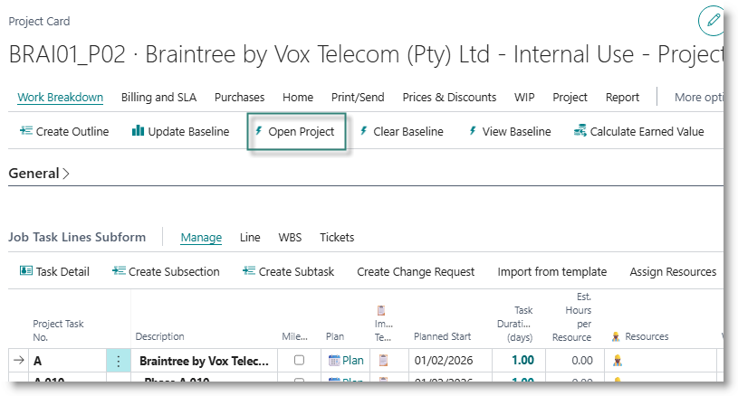
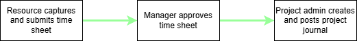
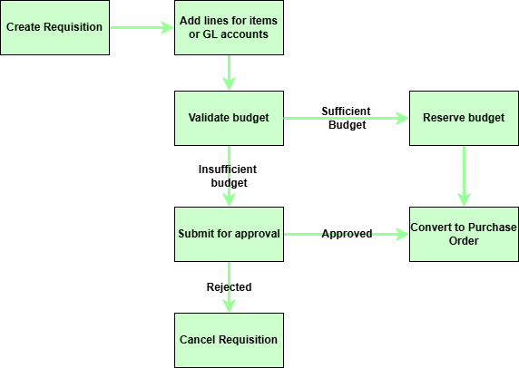
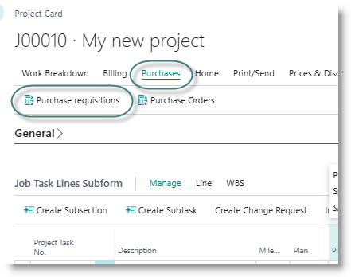
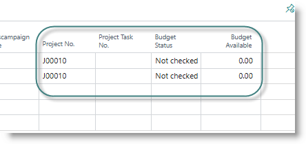
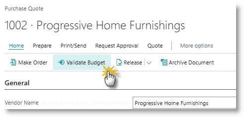

# Planned Costs, Committed Costs and Actual Costs
Before work commences on a project, the cost of executing the project - labour, material and general expenses -  is estimated. This estimate becomes the initial planned cost, or baseline budget. As the project progresses, planned costs may be revised due to many reasons:

- as work proceeds, new information becomes available and requirements are refined
- some activities may be delivered faster (or slower) than initially expected.
- changes in pricing from suppliers
- environmental factors 
- changes in scope
- unexpected roadblocks

A project manager will need to continually revise the planned costs as the project progresses. The revised planned costs become a forecast for completion of the project.

To execute the project, costs are incurred, typically in the form of labour, materials, but may also include other expenses, such as travel, accommodation, subcontracting. Incurred costs are compared to planned and baseline costs to assess the progress and profitability of the project.

In conventional ERP systems, incurred costs are recognised only when they are recorded as actual expenses in the general ledger, for example when a supplier invoices has been posted. For projects, this is often too late for effective budget control. As soon as a project manager makes a decision to procure materials, the cost is considered to be committed, and available budget is reduced. 

- *Committed Costs* are costs for services which have been requested, but not yet delivered. Purchases at requisition stage or order stage are considered committed, and the cost is reserved against the budget
- *Actual Costs* are costs for services which have finalised and recorded in the general ledger. For purchases, this means that an invoice from a supplier has been received and recorded in the financial system.

# Recording Costs
After creating the work breakdown structure (WBS), assigning resources and setting a baseline, you are ready to start work on the project.

From the project card, change the status from Planning to Open:

Costs can be assigned to a project by:
- [Capturing time sheets for resources](#resource-time-sheets)
- [Capturing purchases against the project](#purchase-requisitions-orders-and-invoices)
- [Capturing project journals to issue inventory to projects, or to assign general expenses to projects](#project-journals)

# Resource Time Sheets
If you want to track the cost of work performed on a project by your own resources, you can use the standard time sheet functionality in Business Central. This allows you to:

- have individual users record the time they spent working on project tasks
- have line managers review and approve the resources' time sheets
- post the costs to the project after review

Refer to Microsoft documentation on how to set up, capture and post time sheets.

## Purchase Requisitions, Orders and Invoices
Purchases for inventory items or general expenses can be linked to projects, using a requisition or order. The purchase document must be validated to verify that sufficient budget is available. Once the document is validated and approved, the cost will reflect on the project as committed budget. Thereafter, the process follows the standard Business Central process, where the requisition is converted to the order, the order is received, and then invoiced.

 

## Create a Purchase Requisition
From the project card, select Purchases -> Purchase Requisitions:

Click New to create a new purchase requisition. An empty purchase quote will be opened.
Select a vendor, and complete the remaining details. Note that the Project number is populated, and budget status is set to 'Not Checked'.

Capture the items being purchased for the project. These could be items or GL Accounts. 
Scroll to the right of the Lines subpage, until the Project fields are visible:

Click in the Project Task No. column, and select a task number.

Note that the budget status is set to 'Not Checked', and the Budget Available is zero.

After capturing all the lines for the requisition, click on 'Validate Budget':

The system checks the amount requested on each line, against available budget for the task and type (ie item or GL account). If budget is available for the line, the status changes to 'Reserved'. If there is not enough budget, the status changes to 'Insufficient'. 

# Project Journals
Project journals allow you to assign resource costs, material costs or general ledger expenses to a project task.

Search for and open 'Project Journal'.  On the journal page, capture the costs as follows:

|Column | Description |
|---|---|
|Posting Date |Date on which costs are recorded|
|Document No.|Document number|
|Project No.|Project number|
|Project Task No.|Task number to which costs are assigned|
|Type|Choose from Resource, Item or G/L Account|
|No.|Choose from the dropdown|
|Description|Description of transaction|
|Quantity|Quantity to consume|
|Location code|For items, the location from which stock will be issued|
|Work Type Code|For resources, optional work type code|
|Unit of measure code||
|Unit Cost|Default from source item, override if required|
|Unit cost (LCY)|Default from source item, override if required|
|Total Cost||
|Total Cost (LCY)||
|Unit Price|Default from source item, override if required|
|Line Amount||
