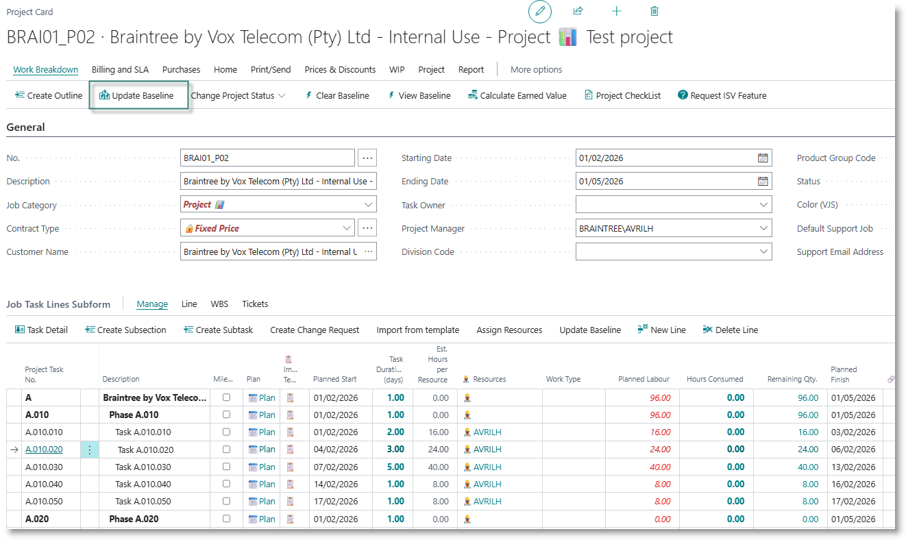
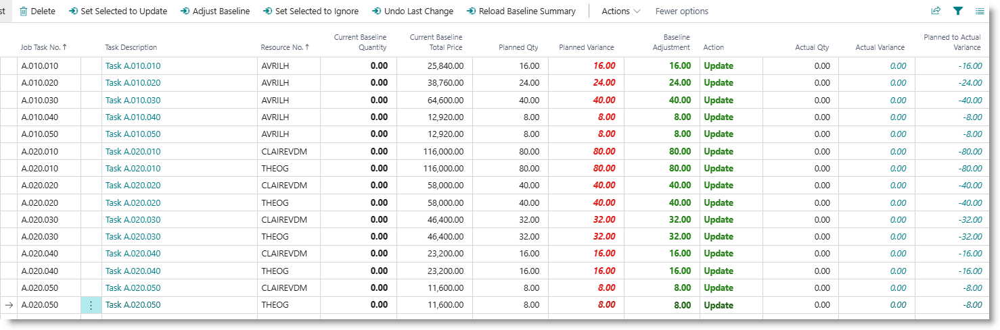
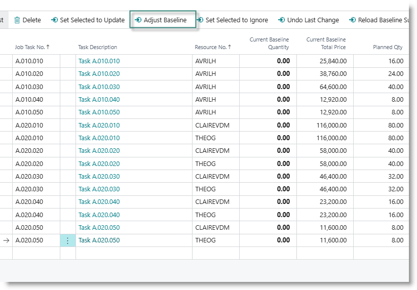
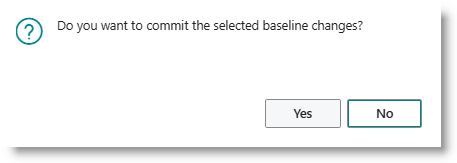
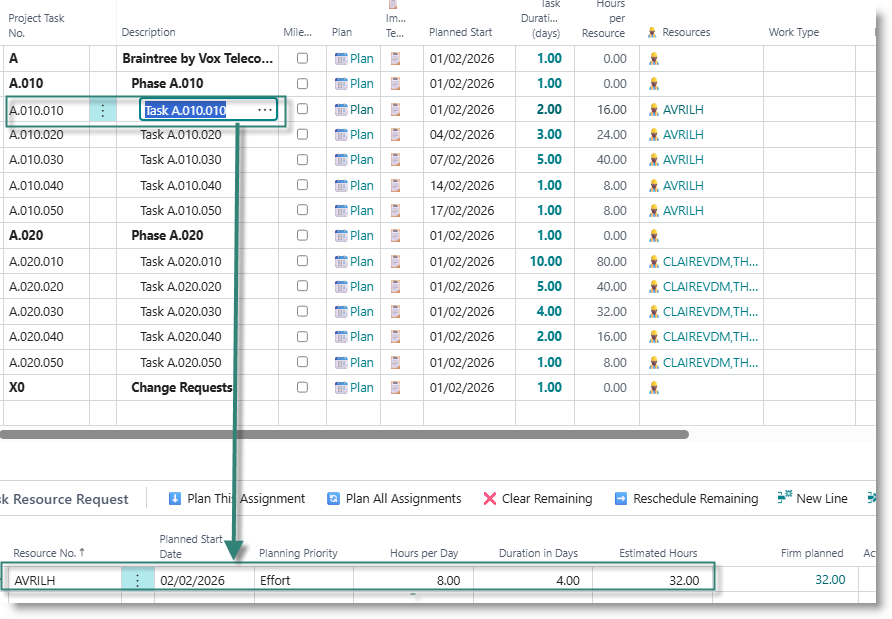
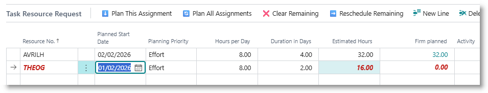
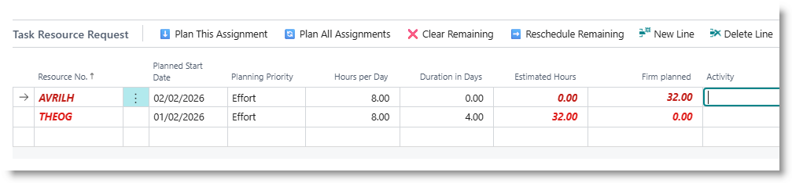
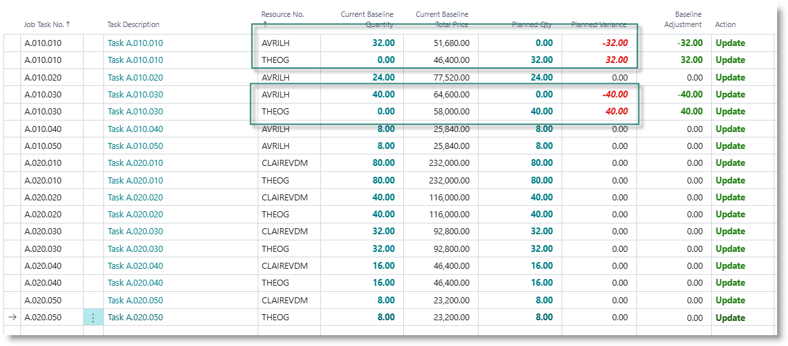
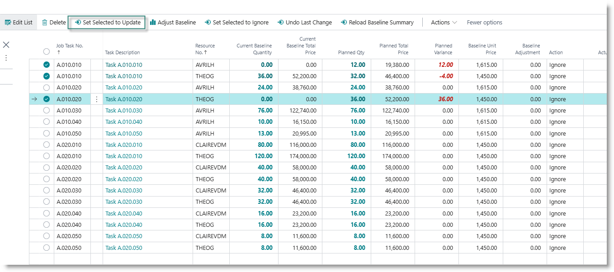
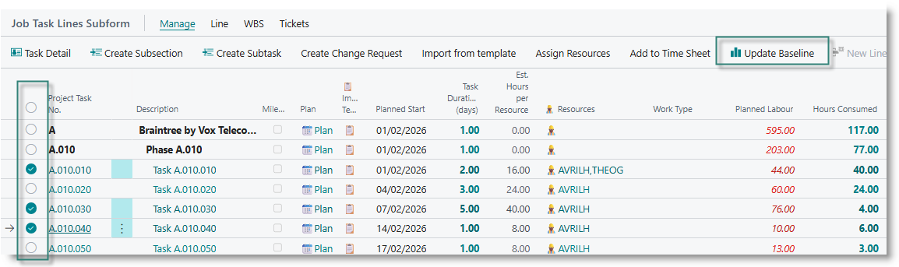

# Why we need baselines
A project baseline records the approved scope (deliverables), time, and cost that has been agreed for the execution of the project. Baselines are used to measure:
- project profitability
- progress against budget
- performance of resources

In PPS, baselines specifically apply to fixed-price projects or tasks.

## When to create or update a baseline
You should update the project baseline under the following circumstances:
- Project start: after all tasks have been planned and resourced, before starting to work on the tasks. This initial budget should match the as-sold value
- New scope: after adding new tasks in response to a change in scope, when the tasks have been planned and resourced.
- When work is transferred from one task or resource to another.
- When it is necessary to re-allocate budget from on task to another. This may happen when a task is completed with less effort than planned.

## Create initial baseline for entire project
After creating, planning and resourcing all tasks as per the initial scope of the project, you can create an initial project baseline.

From the Project menu, click on 'Update Baseline':

  

The baseline summary will appear, summarising planned costs per task and resource.

  

The following information is displayed:

| **Field** | **Content** |
|---|---|
| Task | Manages support requests; usually costed as time and material |
| Resource No. | |
| Current Baseline Quantity | Number of hours previously baselined for the resource on this task|
| Current Baseline Total Price | Monetary value baselined for the resource on this task |
| Planned Qty | Number of hours currently assigned to the resource for this task. This will include actual hours already registered via time sheets |
| Planned Variance | The difference between planned hours and baselined hours (Plan - Baseline). A negative number indicates that the task is under budget, positive number indicates that task is over budget.| 
| Baseline Adjustment | If this is the first time you are updating the Baseline, the column will contain the value of the planned hours allocated to the resource for the task. |
| Action | If the project status = Planning, the column will be set to 'Update', otherwise it is set to 'Ignore'. |
| Actual quantity| Number of hours recorded via Time sheets and posted to the project. |
| Actual Variance| Variance between Actual quantity and Baseline quantity |
| Planned to Actual Variance | Variance between Actual quantity and Planned Quantity|

## Committing the proposed baseline
To save the baseline, click on 'Adjust Baseline':  

Click Yes on the confirmation dialog:

The baseline values are committed to the project, and the page will close. You can view the baseline entries by clicking on 'View Baseline' from the project card.

## Modifying work assignments between resources and tasks

On the project card, select the task you want to modify. The Task Resources list will be displayed below the task list.

Click on the first blank line in the Task Resource request, and select a new resource. 

Adjust the estimated hours as required.

To reduce / remove the hours assigned to the original resource, click in the column 'Estimated Hours'. Change the value to zero to remove the resource's allocation, or amend to the value you intend to use.

Once you are happy with the changes you have made, click on 'Update Baseline' in the project card menu. A new budget proposal will be suggested:

If the status of the project is 'Planning':
- the action on each line with a variance will be set to 'Update'. 
- the budget adjustment will be set to the planned variance (Planned Quantity - Baseline Quantity).

If the status is 'Open':
- the action will be set to 'Ignore'
- the budget adjustment will be set to zero.

You can change the action on individual lines manually, or you can change the status for a number of lines collectively.

To modify the action on multiple lines, select the lines, then click on 'Set Selected to Update':

The status will be modified to 'Update', and the Budget Adjustment value will be set to the planned variance.

Similarly, you can change the status on multiple lines to 'Ignore', which will set the Budget Adjustment value to zero.

## Editing the Budget Adjustment
When the action on a line is set to 'Update', the Budget Adjustment is automatically set to the planned variance. You can override this by clicking in the column, and capturing a new value. Capturing a positive value will cause the budget to be increased, and a negative value will cause the budget to decrease.

## Commit the Baseline changes
Click on 'Adjust Baseline' to commit the changes. On the Project Card, view the baseline. You will see new entries reflecting the changes from the original budget. 

### Creating a partial baseline for selected tasks
You can selectively set or adjust the baseline for certain tasks. In the task list, select one or more tasks, then click on 'Update Baseline' in the task list menu:

The budget for the selected tasks will be displayed.

### View budget
Each time you amend the budget, a new budget number is created. Entries are created in the Project Baseline Entries table reflecting the movement. For example, if you initially set a task budget for 40 hours, then later amend it to 60 hours, there will be two entries in the detailed budget list - one for the initial 40 hours, and a second for the additional 20 hours.

To view the detail, click on 'View Baseline' on the Project Card.