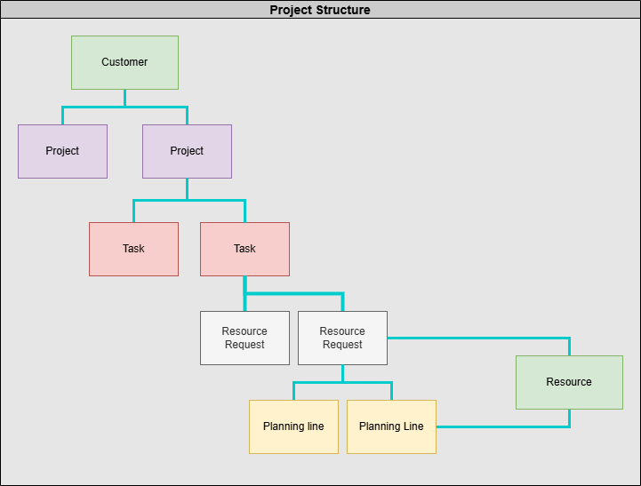
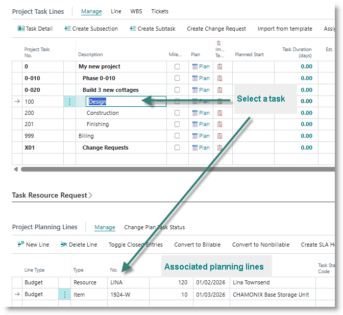
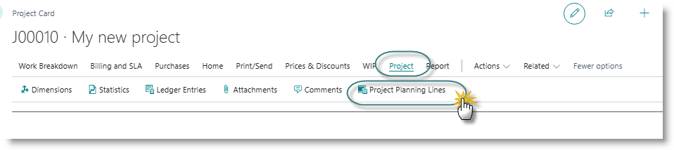
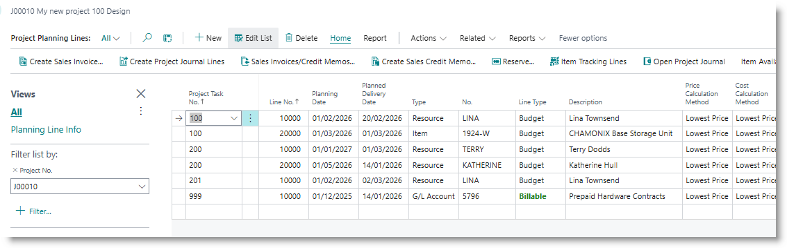

# Understanding Planning Lines
In the Projects module of Microsoft Dynamics 365 Business Central, the Planning Line is the lowest level in the project hierarchical structure.  

Planning lines fulfil the following functions:
- Assigns costs to a task in the form of resources, inventory items or expense accounts.
- Creates budgets for project tasks
- Controls billing for project deliverables
- Control utilisation of actual costs against the budget

Planning lines can be accessed from the projects page in two ways:

**Planning lines linked to task**
- Open the project card.
- Select a task from the Project Task Lines subpage.
- The associated planning lines are displayed in the Project Planning Lines subpage
  

**Project planning lines**
- Open the project card.
- Select the Project menu.
- Select Project Planning Lines.

All planning lines for the project will open.

**Planning Line Fields**
| # | Field Name | Type | Description / Purpose / Usage |
|---:|---|---|---|
| 2 | Job No. | Code[20] | Identifies the parent job that owns this planning line; used in filtering, posting, and reporting by project. |
| 1 | Line No. | Integer | Unique line identifier within a job/task combination; used for sorting, linking, and referencing this planning line from related records. |
| 3 | Planning Date | Date | Date the line is planned to occur; drives scheduling views, workload analysis, and date-based filtering. |
| 4 | Document No. | Code[20] | External/internal document reference tied to the line; used for traceability to source documents. |
| 5 | Type | Option | Classifies what is planned (resource, item, G/L, etc.); controls available validations and pricing/cost behaviour. |
| 6 | No. | Code[20] | Master record number for the selected Type; used to pull defaults such as description, UOM, cost, and price. |
| 7 | Description | Text[100] | Primary description of planned work or material; shown to users on pages, documents, and reports. |
| 8 | Quantity | Decimal | Planned quantity in selected unit of measure; core driver for cost/price totals and fulfilment quantities. |
| 9 | Direct Unit Cost (LCY) | Decimal | Direct local-currency unit cost before additional factors; used as base for cost derivation. |
| 10 | Unit Cost (LCY) | Decimal | Unit cost expressed in local currency; used for local financial reporting and comparisons. |
| 11 | Total Cost (LCY) | Decimal | Total planned cost in local currency; used for budget and accounting analysis in LCY. |
| 12 | Unit Price (LCY) | Decimal | Sales/billing unit price in local currency; supports local reporting and valuation. |
| 13 | Total Price (LCY) | Decimal | Total planned price in local currency; used in local financial reporting. |
| 14 | Resource Group No. | Code[20] | Stores a reference code/number linking this line to master data or related documents for validation and traceability. |
| 15 | Unit of Measure Code | Code[10] | Selected unit for entry/display of quantity; determines quantity conversion and rounding behavior. |
| 21 | Work Type Code | Code[10] | Stores a reference code/number linking this line to master data or related documents for validation and traceability. |
| 27 | Planning Due Date | Date | Target due date for planned completion; used for deadline tracking and planning follow-up. |
| 33 | Job Task No. | Code[20] | Identifies the specific job task under the job; used to group planning, budget, and usage at task level. |
| 34 | Line Amount (LCY) | Decimal | Net line amount in local currency; used for local reporting and analytics. |
| 35 | Unit Cost | Decimal | Unit cost in document currency context; used for margin and total cost calculations. |
| 36 | Total Cost | Decimal | Total planned cost in document currency; usually Quantity x Unit Cost after adjustments. |
| 37 | Unit Price | Decimal | Sales/billing unit price in document currency; used to calculate line amounts and expected revenue. |
| 38 | Total Price | Decimal | Total planned price in document currency; used for billing forecasts and profitability analysis. |
| 39 | Line Amount | Decimal | Net line amount in document currency; used for invoicing and revenue calculations. |
| 40 | Line Discount Amount | Decimal | Absolute discount amount in document currency; used in billing and margin calculations. |
| 41 | Line Discount Amount (LCY) | Decimal | Absolute discount amount in local currency; used in local financial reporting. |
| 47 | Currency Code | Code[10] | Currency used for price/cost amounts on the line; controls exchange rate conversion context. |
| 52 | Job Contract Entry No. | Integer | Stores a reference code/number linking this line to master data or related documents for validation and traceability. |
| 53 | Invoiced Amount (LCY) | Decimal | Stores price, amount, discount, or tax value used to calculate customer billing and revenue figures. |
| 54 | Invoiced Cost Amount (LCY) | Decimal | Stores cost-related value used in budgeting, valuation, and profitability analysis for this planning line. |
| 59 | Description 2 | Text[50] | Secondary free-text description; used when additional line details are needed. |
| 60 | Job Ledger Entry No. | Integer | Stores a reference code/number linking this line to master data or related documents for validation and traceability. |
| 61 | Status | Enum "Job Planning Line Status" | Current processing status of the planning line; drives allowed actions and workflow state. |
| 62 | Ledger Entry Type | Enum "Job Ledger Entry Type" | Stores a control/status indicator that determines processing behaviour and user actions on this planning line. |
| 63 | Ledger Entry No. | Integer | Stores a reference code/number linking this line to master data or related documents for validation and traceability. |
| 65 | Usage Link | Boolean | Indicates whether usage postings are linked to this planning line; used for actual-vs-plan tracking. |
| 66 | Remaining Qty. | Decimal | Unposted/unconsumed quantity still open on the line; used for completion and backlog metrics. |
| 67 | Remaining Qty. (Base) | Decimal | Remaining quantity in base unit; used for accurate inventory and reservation calculations. |
| 68 | Remaining Total Cost | Decimal | Stores cost-related value used in budgeting, valuation, and profitability analysis for this planning line. |
| 69 | Remaining Total Cost (LCY) | Decimal | Stores cost-related value used in budgeting, valuation, and profitability analysis for this planning line. |
| 70 | Remaining Line Amount | Decimal | Stores price, amount, discount, or tax value used to calculate customer billing and revenue figures. |
| 71 | Remaining Line Amount (LCY) | Decimal | Stores price, amount, discount, or tax value used to calculate customer billing and revenue figures. |
| 72 | Qty. Posted | Decimal | Quantity already posted as usage/consumption; used to track progress against plan. |
| 73 | Qty. to Transfer to Journal | Decimal | Stores a quantity metric for planned, remaining, posted, picked, transferred, or invoiced amounts; supports execution and billing control. |
| 74 | Posted Total Cost | Decimal | Stores cost-related value used in budgeting, valuation, and profitability analysis for this planning line. |
| 75 | Posted Total Cost (LCY) | Decimal | Stores cost-related value used in budgeting, valuation, and profitability analysis for this planning line. |
| 76 | Posted Line Amount | Decimal | Stores price, amount, discount, or tax value used to calculate customer billing and revenue figures. |
| 77 | Posted Line Amount (LCY) | Decimal | Stores price, amount, discount, or tax value used to calculate customer billing and revenue figures. |
| 78 | Qty. Transferred to Invoice | Decimal | Stores a quantity metric for planned, remaining, posted, picked, transferred, or invoiced amounts; supports execution and billing control. |
| 79 | Qty. to Transfer to Invoice | Decimal | Stores a quantity metric for planned, remaining, posted, picked, transferred, or invoiced amounts; supports execution and billing control. |
| 80 | Qty. Invoiced | Decimal | Quantity already invoiced; used for billing progress and remaining billable quantity. |
| 81 | Qty. to Invoice | Decimal | Quantity currently marked for invoicing; used in invoice proposal and posting routines. |
| 89 | Quantity (Base) | Decimal | Planned quantity converted to base unit; used for inventory math and consistent quantity calculations. |
| 90 | Requested Delivery Date | Date | Date requested for delivery/availability; supports planning and vendor/customer commitments. |
| 91 | Promised Delivery Date | Date | Date promised for delivery; used to monitor delivery performance. |
| 92 | Planned Delivery Date | Date | System/planner-calculated delivery date; used in supply and schedule planning. |
| 93 | Package No. | Code[50] | Stores a reference code/number linking this line to master data or related documents for validation and traceability. |
| 101 | Qty. on Journal | Decimal | Stores a quantity metric for planned, remaining, posted, picked, transferred, or invoiced amounts; supports execution and billing control. |
