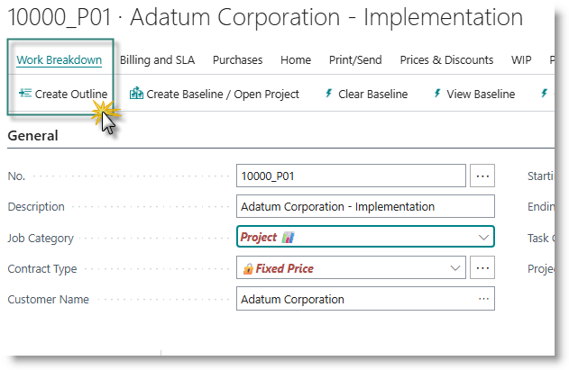
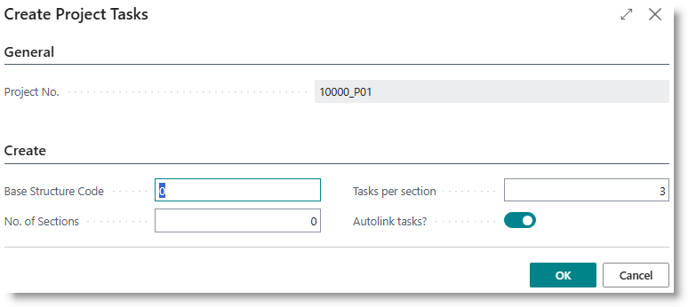
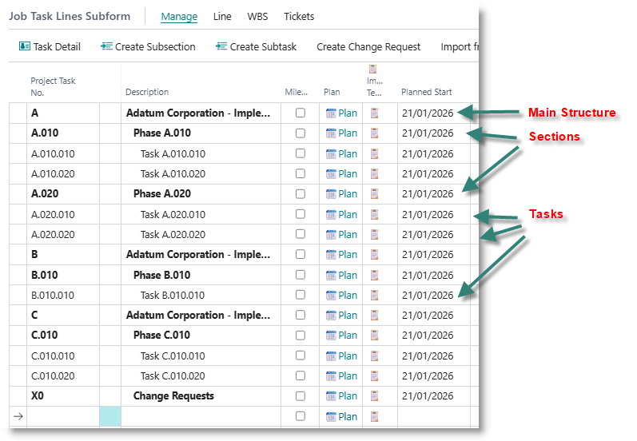
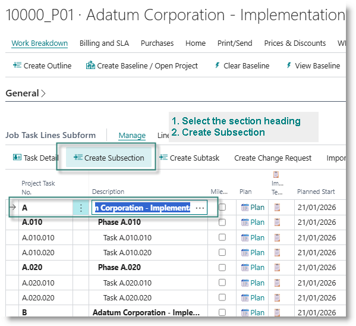
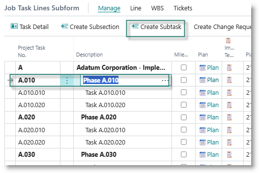

## Create a work breakdown structure
This section typically applies to projects and product development projects. For support projects, you should use tickets to create new tasks.

An initial outline can be generated from the Project creation dialogue, or created after the project has been created. Extra phases or activities can be added to the WBS at any time.

## Create initial outline from project card
After creating the project, you can edit and update the Work Breakdown Structure (WBS) by adding new sections, subsections or tasks.

## Create new structure
To create a new structure to the project, click on 'Create Outline' from the project card:

The 'Create Project Tasks' dialog will open:

Capture the fields as follows:

| **Field Name** | **Definition** |
|---|---|
| Base Structure Code | The WBS code for the top level of the structure, typically a single character, for example 0, 1, A, B |
| No. of Sections | The number of subsections to create |
| Tasks per section | Per section - the number of lower level tasks to create|
| Autolink | If turned on, the system will automatically link the tasks using a Finish-Start link. |

When you have captured the parameters, click on OK.  Below is an example of a project with 3 main Structures, each with multiple sections and tasks.

**Add a new section to the WBS**
Select the heading under which you want to add the new structure. On the tasks subpage, click on 'Create Subsection':

**Add a new task to a section**
Select the heading under which you want to add a new task, and click on 'Create Subtask':

A new task will be added to the end of the selected section.