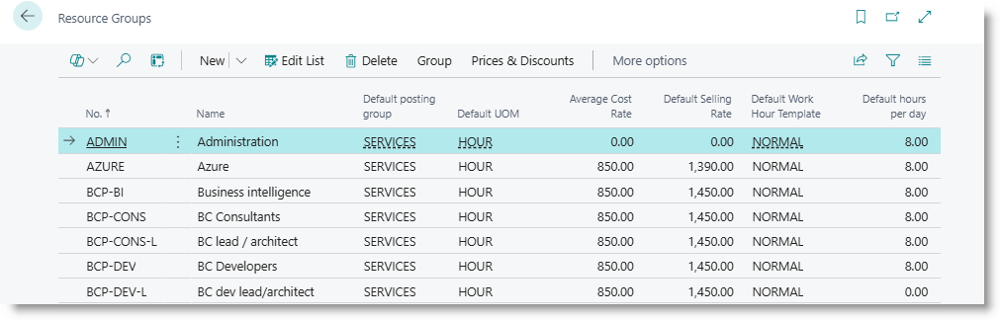

# Resource Groups
Resource groups provide a way to group similar resources, and to provide default values which can be applied to a new resource.

Search for 'Resource Groups'. The Resource Groups list is displayed.

Click on 'New' to create a new code, or click on 'Edit List' to modify details.

|**Column** |**Details**|
|---|---|
|No.|Unique code to identify the group|
|Name|Descriptive name of the group|
|Default Posting Group|The posting group to be assigned to new resources|
|Default UOM|The unit of measure to be assigned to new resources|
|Average Cost Rate |Average hourly cost rate for the Resources assigned to the group|
|Default Selling Rate|The selling rate to be assigned to new resources|
|Default Work Hour Template|The work hour template to be assigned to a new resource|
|Default Hours per day|The number of work hours to be assigned to a new resource.|
