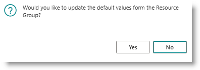
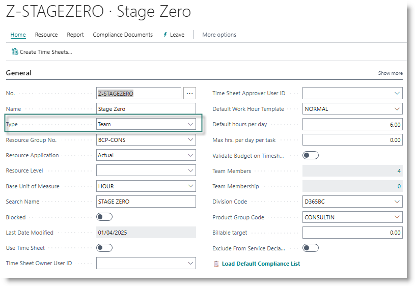
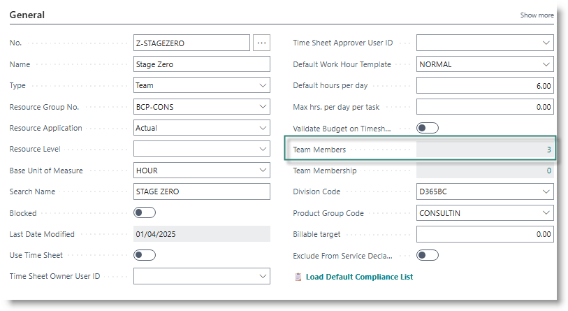
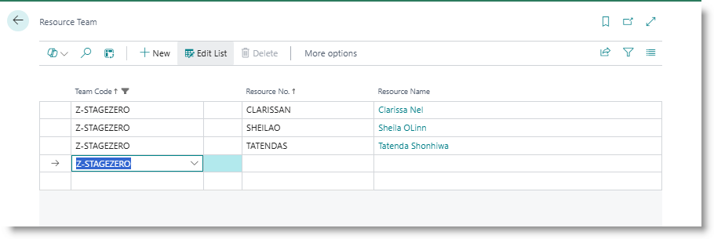

# Resource Management
Each individual who works on projects or support needs to be created as a Resource, which then allows them to be assigned to a task, and to do time sheets.

## Creating a new resource
Go to Resources.
From the Resource list, click on 'New'.

Enter a code for the resource. This will typically be the person's first name, followed by the initial of their surname.

Enter the resource name.

Select a Resource Group. You will be prompted to update the default values for the resource:

Click on Yes. This will assign the default values for Base Unit of Measure, Default Work Hour Template, Default Hours per Day, General Product Posting Group, VAT product posting group, direct unit cost and Unit Price.

Turn on the switch 'Use Time Sheet'.

In the field 'Time Sheet Owner USer ID', select the user name for the resource.

In the field 'Time Sheet Approver User ID', select the user name for the resource's line manager.

Assign the appropriate dimension values to the global dimensions Division Code and Product Group Code.

## Creating a Resource Team
Resource teams can be used to collectively assign a group of resources to a task. A resource can be a member of multiple teams. When you use a Team as the Lead Resource on a ticket or project task, it will automatically create a resource assignment for each resource in the team. If the Team is assigned as the Task Owner on the support project, the ticket will be assigned to each resource in the team.  

Go to Resources and click on New.
Assign a code for the group, and capture a name. 

Set the type = 'Team'.

The remaining fields should be completed in the same way as an individual resource.

After the record has been created, you can assign resources to the team.  Drill down on the field 'Team members':

The list of existing team members will open. Click on New to add a resource.

## Assigning a resource to an existing team
On the resource card, drill down on the field 'Team Membership'. From here, you can select one or more teams to which the resource should be assigned.

## Generating resource capacity
